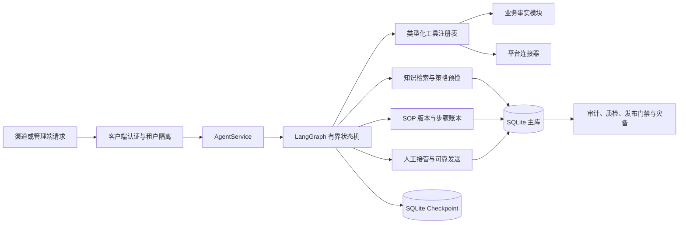

# 云湃电商 Agent 0.13.0 技术实现说明

日期：2026-07-21

## 1. 当前定位

当前版本是可运行、可测试、可审计的本地生产候选，不是已经接通真实店铺的最终生产版本。系统采用“控制面与执行面分离”的结构：后台负责知识、SOP、发布和人工处置；Agent 执行面只使用已经注册、通过策略校验的能力。真实淘宝机器人资格、店铺授权、ERP/OMS 写接口和客户数据回放仍是生产放行前置条件。

## 2. 总体运行链路

请求先经过 `AuthService` 校验客户端密钥、租户和上游能力，再由 `AgentService` 组装可信上下文。模型只能提出决策，不能直接获得执行权限。工具注册表、SOP 当前步骤、可信上下文和发布模式共同决定工具是否可执行。

## 3. Agent 核心

实现位置：`src/ecommerce_agent/service.py`、`graph.py`、`decision.py`、`schemas.py`。

Agent 使用 LangGraph 组织有界 ReAct 流程，主要节点为输入规范化、安全预检、知识检索、决策、决策门、工具门、执行、回复审查和持久化。`max_react_steps` 限制单轮推理步数；模型不可用、输出不合法、工具条件不足或超过步数时，流程确定性降级为澄清、拒绝或人工接管。

状态保存在独立 checkpoint 数据库，业务事实、消息和审计保存在主数据库。用户正文不能自行声明已授权订单上下文，只有 `api_clients.can_supply_order_context` 允许的上游客户端才能注入只读订单标识。

## 4. SOP 执行引擎

实现位置：`src/ecommerce_agent/sops.py`、`database.py`、`governance_api.py`。

SOP DSL v2 将每一步解析为类型化 `SopStep`，支持 `clarify_if_missing`、`observe`、`evaluate`、`propose`、`act`。每步有稳定 ID、最大尝试次数、是否审批、补偿工具和成功后置条件。动作步骤固定为单次尝试，高风险或关键风险动作必须声明人工审批。

定义按 `draft -> evaluated -> approved -> active -> retired` 发布。评测会检查正常路径、缺失上下文、转人工、写保护、高风险审批、工具注册类型和补偿工具。会话第一次命中 SOP 后固定版本，后续发布不会改变正在运行的流程。

schema v13 使用 `sop_runs` 保存流程级游标和版本，使用 `sop_step_runs` 保存逐步状态、输入哈希、幂等键、尝试次数、结果摘要、后置条件、审批人、补偿状态和乐观锁版本。核心状态包括：

- 运行：`pending`、`waiting_input`、`waiting_approval`、`running`、`succeeded`、`failed`、`uncertain`。
- 补偿：`compensating`、`compensated`、`compensation_failed`、`compensation_uncertain`。
- 流程：`active`、`completed`、`handoff`、`failed`。

重启恢复只会自动重排未耗尽预算的读取步骤。中断的写动作标记为 `uncertain`，中断的补偿标记为 `compensation_uncertain`，必须从业务系统读回后由管理员确认成功或失败，系统不会盲目重试。

## 5. 工具执行与安全门

实现位置：`src/ecommerce_agent/tools.py`、`policy.py`、`business/service.py`。

每个工具通过 `ToolSpec` 声明名称、读写类型、Pydantic 输入模型、可信上下文字段、幂等字段、超时、重试预算、策略函数和后置验证器。`observe` 只能调用读工具，`act` 只能调用写工具。读工具可对明确标记为可重试的失败短重试；写工具超时或异常统一返回 `uncertain`，禁止自动重试。

写工具必须声明幂等字段和后置验证器。SOP 步骤结果只持久化有界摘要；密码、令牌、密钥、Cookie、验证码等敏感字段按结构化键删除，手机号、身份证和银行卡等文本继续掩码。

## 6. 智能客服

实现位置：`rag.py`、`knowledge_management.py`、`handoff.py`、`outbox.py`、`taobao.py`。

知识按平台、行业、店铺、商品和进化层级管理，内容版本不可变，必须评测和批准后才能进入检索。检索结合租户、店铺、SKU、关键词和哈希向量；命中不足时不编造答案。

人工任务使用受控状态迁移和乐观锁。渠道会话明确区分机器人、人工和暂停归属；人工接管后，发送 worker 在真正投递前再次校验会话归属和凭据版本。出站消息先进入持久 outbox，经过租约抢占、幂等、重试预算、死信和人工核对，`uncertain` 消息不能直接重发。

淘宝模块已实现 OAuth state、防重放、凭据加密、TOP/奇门签名、消息幂等、能力注册和本地虚拟接入。真实消息收发尚未验收，因此默认保持关闭。

## 7. 竞品分析与经营事实

实现位置：`src/ecommerce_agent/business/competitive.py`、`catalog.py`、`inventory.py`、`orders.py`、`metrics.py`。

竞品数据只接受授权连接器、许可数据、人工导入或明确虚拟来源。每条观察保存来源、观察时间、版本、载荷哈希和是否估算；同版本冲突和旧版本会被拒绝。分析层计算本店与竞品价差、价格位置、趋势和风险提示，并把估算值与店铺事实分开标识。

商品、库存、订单、物流和售后采用同样的租户、来源、时间和版本约束。指标不是模型拼接 SQL，而是固定 `QuerySpec` 和代码定义，返回口径版本、数据水位、质量状态和证据数量。当前版本不自动调价、退款、赔付、采购或调拨。

## 8. 后台管理

实现位置：`src/ecommerce_agent/admin_api.py`、`governance_api.py`、`operations_api.py`、`release_api.py`、`docs/admin-console.html`。

后台采用单页控制台，覆盖经营总览、客服会话、人工任务、商品库存、订单售后、竞品分析、知识/SOP、质检 VOC、渠道接待、发布门禁、模块注册和审计。所有管理 API 要求管理员 ID 和密钥，并按管理员所属租户查询。

SOP 运行表显示流程状态、当前步骤、尝试次数、错误和锁版本。批准、不确定态确认、读取重试和补偿使用页面内处置对话框提交说明；补偿额外要求 JSON 参数。API 使用步骤级 `record_version` 防止两个管理员覆盖彼此判断，冲突返回 409。

## 9. 质检、VOC 和进化

实现位置：`quality.py`、`evolution.py`、`knowledge_management.py`。

质检规则由代码确定，输出分数、问题代码和严重度；人工可以确认或驳回结果。VOC 当前是确定性聚合，不依赖模型自由生成。会话中出现的新问法只能形成进化候选，必须经过评测、批准和版本发布后才成为知识，线上运行不会直接自我修改提示词或规则。

## 10. 发布门禁与运维

实现位置：`releases.py`、`outbox.py`、`disaster_recovery.py`、`maintenance.py`。

发布策略是不可变版本，支持 `shadow`、`assist`、`collaborative`、`automatic` 四种模式，使用稳定哈希分流。完整 Agent 在临时数据库快照中执行回放；回放、双人审批和运行指标满足阈值后才能启用。严重错误或投递失败超过预算会自动暂停。

主库和 checkpoint 支持 AES-256-GCM 加密备份、校验、staging 恢复、失败回滚、换钥和保留清理。运行目录互斥锁阻止同一数据目录被第二个服务实例或恢复任务同时打开。

## 11. 当前生产边界

0.13.0 已达到本地生产候选的实现和测试标准，但生产 Gate 仍为 NO-GO。必须补齐真实平台/ERP 联调、客户脱敏回放、真实模型探测、小流量灰度、24 小时长稳与故障注入、异机恢复和业务 RPO/RTO 签收后，才能允许真实自动写操作。
