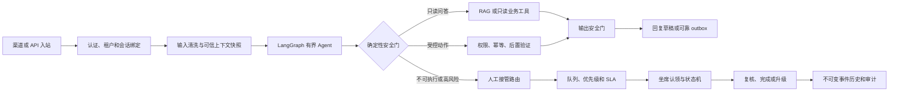
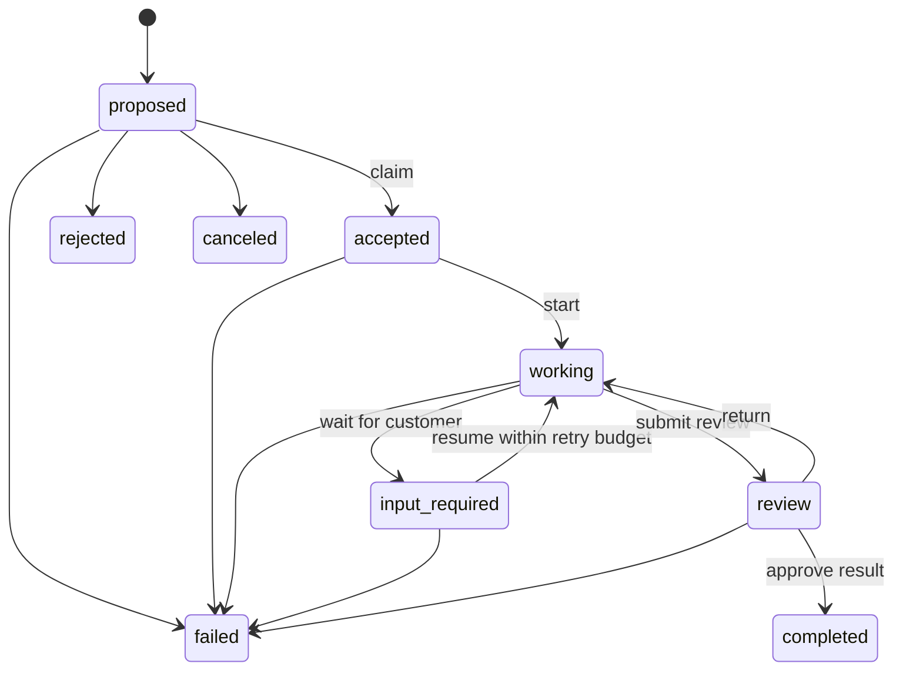

# 云湃电商 Agent 0.19.0 技术实现说明

## 1. 版本定位

0.19.0 把原有“创建一条人工任务”的基础能力升级为可操作、可并发、可升级、可审计的人工接管工作台。它仍是单机 SQLite 架构的本地代码级候选，不把真实渠道、真实模型、客户业务阈值或生产运维 Gate 伪装成已完成。

本版重点解决四个问题：

1. Agent 为什么转人工、转到哪个队列、优先级和时限是什么；
2. 多个坐席同时认领时谁获得任务，谁能继续推进；
3. 首响或解决超时后如何自动升级，并保证重复扫描不重复升级；
4. 管理员如何在同一页面完成筛选、认领、处理、复核、转派、升级、备注和审计回放。

## 2. 总体技术路径



职责边界保持不变：模型负责理解、建议和选择通用执行语义；固化代码负责身份、权限、风险、状态机、路由、并发、时限、成功判定和审计。模型不能通过输出 `answer` 绕过高风险动作门。

## 3. Agent 核心编排

### 3.1 输入和上下文

- API 客户端凭据绑定租户、客户端和主体，外部 `session_id` 不能跨租户复用。
- 输入在进入 checkpoint 前执行白名单清洗和敏感信息脱敏。
- `ContextBuilder` 按会话、商品/订单事实、SOP、知识、工具目录和输出约束的固定顺序生成不可变上下文快照。
- 上下文身份冲突、授权冲突或证据完整性失败会在调用模型前 fail closed。

### 3.2 规划和执行

- LangGraph 使用 `answer/clarify/observe/act/handoff/refuse/finish` 七类通用决策，不把具体业务意图硬编码为图节点。
- `observe` 只调用注册的只读工具；`act` 还需要能力声明、可信权限、幂等键、后置验证器和发布策略共同放行。
- ReAct 循环有步数和重试预算。读失败可以按契约短重试；写入结果不确定时不自动重放，而是转人工核对。
- RAG 只提供事实、流程和批准话术，不承载权限、金额阈值或风险规则。

### 3.3 0.19.0 高风险最终保护

`is_business_action_request()` 现在同时用于模型模拟器和真实图运行时。只要用户请求属于改地址、取消订单、退款、赔付、支付、账户安全等业务动作，运行时就把风险提升为 `high`。如果模型仍返回 `answer` 或 `clarify`，图会强制改为：

```text
action = handoff
reason = business_action_requires_verified_execution
risk_level = high
```

只有已验证的工具执行、明确拒绝或既有人工接管结果可以结束该路径。这个保护位于模型决策之后，因此不依赖某个模型是否正确识别中文短语。

## 4. 人工接管工作台

### 4.1 队列策略

每个租户首次使用时创建四个默认队列：

| 队列 | 命中范围 | 默认优先级 | 首响 / 解决 SLA | 单坐席容量 | 默认升级 |
|---|---|---:|---:|---:|---|
| `complaints` | 投诉、重大风险、`critical/blocked` | 紧急 | 5 / 60 分钟 | 8 | 无 |
| `after_sales` | 退款、退换、订单、物流、授权上下文缺失 | 高 | 10 / 240 分钟 | 15 | 投诉队列 |
| `technical` | 模型、工具、ReAct、上下文和渠道故障 | 高 | 15 / 240 分钟 | 20 | 投诉队列 |
| `general` | 未命中特定规则的通用接管 | 普通 | 30 / 480 分钟 | 20 | 投诉队列 |

路由按 `routing_order` 从小到大执行，分别匹配原因、意图和风险级别。原因规则支持安全的后缀通配符，例如 `tool_*`；不支持任意正则。显式 `queue_key` 可覆盖自动路由，但必须属于当前租户且处于启用状态。最后一个兜底队列不能停用，升级队列不能指向自身，非法 token 和不存在的队列全部拒绝。

优先级为 `low < normal < high < urgent`。队列给出默认值，高风险任务至少提升到 `high`，`critical/blocked` 直接提升到 `urgent`，低优先级参数不能降低风险决定。

### 4.2 任务状态机



- 认领只允许 `proposed -> accepted`，并要求任务仍未分配。
- `accepted/working/input_required` 只有当前负责人可以推进。
- `input_required -> working` 会消耗重试预算，超预算拒绝。
- `completed/rejected/failed/canceled` 是终态；进入任何终态必须提供处置说明。
- 转派要求任务已认领，并在目标队列重新检查坐席容量。
- 备注、转派、升级和每次状态迁移都会增加任务版本。

### 4.3 并发和租户隔离

所有更新在数据库写锁和单一 SQLite 事务中完成，同时使用 `WHERE version=?` 的乐观锁。认领还要求 `status='proposed' AND assigned_to IS NULL`，因此多个线程读取到同一旧版本时只有一个更新成功。API 不先做一个无锁“存在性检查”再修改，而是把 `tenant_id` 直接放进服务层查询和更新条件，避免检查与修改之间的 TOCTOU 窗口。

单坐席容量统计只计算同租户、同队列、同坐席的活动任务，终态不占容量。跨租户读取、认领、转派、升级、备注和历史查询都返回未找到，不泄露对象是否存在。

### 4.4 SLA 计算和升级

任务创建时从队列策略计算：

- `sla_first_response_at = created_at + first_response_sla_minutes`
- `sla_resolution_at = created_at + resolution_sla_minutes`

首响以 `acknowledged_at` 为完成点，解决以终态时间为完成点。开放任务动态计算 `on_track/due_soon/breached`；最后 20% 的 SLA 窗口视为 `due_soon`，提示区间最短 1 分钟、最长 15 分钟。已完成目标显示 `met`，未分配筛选作为工作台运营视图单独提供。

后台 worker 默认每 30 秒扫描全部租户：首次响应超时升级到 L1，解决超时升级到 L2。L1 至少提升到高优先级，L2 提升到紧急；若配置了升级队列则原子迁移。任务已经处于相同或更高级别时跳过，因此重复扫描幂等。并发修改形成版本冲突时记录为 conflict，下一周期重新评估，不覆盖坐席的新状态。

### 4.5 事件历史和脱敏

`handoff_task_events` 对每个任务保存 `created/claimed/transitioned/reassigned/escalated/note_added` 事件。`(handoff_id, task_version)` 唯一，事件包括前后状态、前后队列、前后负责人、操作者、脱敏说明和时间。任务表保存当前投影，事件表保存可回放历史；普通操作不能修改历史行。

所有处置说明在落库前调用统一敏感信息脱敏。业务审计另存事件类别和必要的结构化元数据，不记录模型隐式思维过程。

## 5. schema v19

### 5.1 `handoff_queues`

保存租户队列键、显示名、状态、默认优先级、首响/解决 SLA、单坐席容量、升级队列、原因/意图/风险规则、路由顺序、乐观锁版本、创建人和时间。

### 5.2 `handoff_tasks` 扩展

新增 `queue_id`、`priority`、两个 SLA 截止时间、认领/开始/复核/升级时间、升级级别和升级原因。旧有 `deadline_at` 继续映射到解决时限，保持历史 API 和备份兼容。

### 5.3 `handoff_task_events`

保存不可变任务事件和任务版本。外键指向任务及队列，任务删除时事件级联删除，队列引用删除时置空以保留历史语义。

### 5.4 v18 到 v19 迁移

迁移为每个已有租户创建 `general` 队列，把旧任务挂入该队列，并从旧 `deadline_at` 填充解决 SLA。已有状态、负责人、重试次数、版本和完成时间不重置；每个旧任务补一条 `migrated` 事件，其事件版本与当前任务版本一致。初始化后执行物理表、列、索引和外键契约校验，伪造 `user_version=19` 但缺少结构的数据库会拒绝启动。

## 6. 管理 API

| 方法与路径 | 作用 |
|---|---|
| `GET /v1/handoffs` | 按状态、队列、优先级、负责人和 SLA 查询 |
| `GET /v1/handoffs/summary` | 待处理、未认领、违约、即将到期、升级和响应时长 KPI |
| `GET /v1/handoffs/queues` | 队列策略与实时负载 |
| `PUT /v1/handoffs/queues/{queue_key}` | 创建或带版本更新队列策略 |
| `POST /v1/handoffs/escalate-due` | 管理员手工触发一次 SLA 扫描 |
| `GET /v1/handoffs/{id}/history` | 任务事件历史 |
| `POST /v1/handoffs/{id}/claim` | 原子认领 |
| `POST /v1/handoffs/{id}/transition` | 推进合法状态 |
| `POST /v1/handoffs/{id}/reassign` | 转派坐席或队列 |
| `POST /v1/handoffs/{id}/escalate` | 手工升级 |
| `POST /v1/handoffs/{id}/notes` | 添加脱敏备注 |

管理 API 使用服务端认证的管理员 ID 作为 actor，不接受正文自报操作人。Pydantic 请求模型限制状态、优先级、队列键、说明长度、SLA 范围和版本字段；业务冲突统一返回 409，输入错误返回 422，跨租户对象返回 404。

## 7. 管理后台

“智能客服”页面包含四层工作区：

1. 会话列表和证据回放；
2. 待处理、SLA 违约、升级中、平均首响 KPI；
3. 人工任务筛选、状态和操作区；
4. 队列策略编辑和受控对话测试。

任务操作全部使用页面内对话框，显示任务 ID、队列和当前锁版本。按钮由当前状态生成，用户不会看到非法迁移入口。提交后重新拉取任务、汇总和队列负载，冲突不会静默覆盖。事件历史以版本顺序展示。队列策略编辑覆盖启停、优先级、SLA、容量、升级队列和路由规则。

表格在窄屏使用内部横向滚动，页面本身不产生全局横向溢出；390px 下标题和筛选器改为上下布局，避免标题逐字换行。

## 8. 其他模块的设计与实现

| 模块 | 当前实现 | 关键边界 |
|---|---|---|
| 智能客服 Agent | LangGraph、有界 ReAct、结构化决策、RAG、可信上下文、工具目录、输出安全门、持久会话 | 模型不拥有权限和成功判定权 |
| 渠道运行时 | 入站事件与 Agent 任务同事务；租约 worker；shadow/assist/collaborative/automatic 四模式 | 真实淘宝仍受资质和凭证阻塞 |
| 可靠发送 | AES-GCM 加密 outbox、幂等键、退避、死信、调用后不确定态人工核对 | 不确定结果不盲目重发 |
| 竞品分析 | 可解释同款评分、硬冲突、人工裁决、价格/卖点/脱敏聚合口碑、版本化告警和 worker | approved-only；不抓未授权数据，不自动改价 |
| 商品 | SPU/SKU 与渠道 Listing 事实、来源时间、载荷哈希、版本冲突 | 外部事实必须经 Connector |
| 订单/物流/售后 | 订单行、脱敏物流、售后单、原子聚合和不可变历史 | V1 不自动退款或赔付 |
| 库存 | 多仓余额、可售量、覆盖天数、缺货/滞销诊断和补货建议 | 不替代 WMS，不自动采购调拨 |
| 经营指标 | 六项代码化指标和严格 `QuerySpec`，返回定义版本、水位、质量和证据 | 模型不能拼接 SQL 或修改公式 |
| 知识与 SOP | 五层知识、不可变版本、审批/回滚；SOP 逐步账本、审批、重试、未知态和补偿 | 风险策略不进入 RAG；真实写工具仍待联调 |
| 质检与 VOC | 确定性规则、证据、人工复核和问题汇总 | 不自动修改线上知识或规则 |
| 客户评测与发布 | 冻结标注集、完整性哈希、隔离实际 Agent、回归指标、双人发布、稳定分流和熔断 | 真实客户数据和模型基线未完成 |
| Connector SDK | 能力声明、连接检查、拉取、Webhook、动作、幂等和读回；当前有显式虚拟淘宝实现 | 不使用 Cookie 抓取或客户端注入 |
| 运维与灾备 | health/ready、运行锁、留存、加密双库备份、验证、恢复、回滚、换钥 | 目标设备长稳、异机恢复和密钥托管未验收 |
| 营销与利润 | 模块注册和边界已定义 | 仍为 planned，不宣称可用 |

## 9. 运行配置

```text
HANDOFF_SLA_WORKER_ENABLED=true
HANDOFF_SLA_POLL_SECONDS=30
```

生产配置构造默认启用 SLA worker；测试配置默认关闭，防止后台线程干扰隔离用例。`/health` 暴露 enabled/running/poll_seconds/cycles/escalated/last_run_at/last_error，`/ready` 在启用时要求线程存活。

当前架构面向单机或单写实例。SQLite 写锁、WAL、事务和乐观锁足以支持这一边界；多进程、多节点和高可用部署必须先迁移 PostgreSQL，并把 SLA 调度、任务领取和 outbox 租约改为数据库级并发控制。

## 10. 生产实施顺序

1. 用客户确认的脱敏会话和人工工单校准路由、优先级、首响/解决 SLA、容量和升级链；
2. 使用固定真实模型、知识、SOP 和事实版本运行客户评测集，复核所有高风险转人工；
3. 接入合法渠道后先运行 shadow，验证不丢消息、不串会话、无线上副作用和可停止；
4. 进入 assist，让坐席使用人工工作台处理真实任务，统计队列负载、误路由、超时和复核退回；
5. 在目标一体机执行 24/72 小时长稳、容量、故障注入、安全和异机灾备；
6. 只有业务、安全、运维和渠道 Gate 全部签收后，才允许 collaborative 灰度；无人值守 automatic 需要单独审批。

