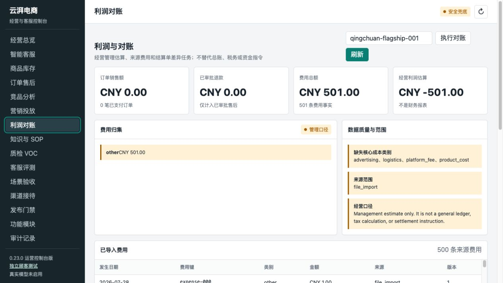

# 利润报告费用截断修复证据

## 问题

`FinanceService.profit_report()` 复用了费用列表查询。该查询面向管理后台表格，
默认只返回 500 条记录，导致利润报告也静默忽略第 501 条及之后的费用。

固定数据集：

- 店铺：`qingchuan-flagship-001`
- 已持久化费用：501 条
- 每条费用：CNY 1.00
- 已支付订单：0 笔

修复前，费用列表按设计返回 500 条，但利润报告也错误地只统计 500 条：


## 修复

费用列表接口继续保留 500 条上限；利润报告在相同店铺与日期范围内读取全部费用，
因此不会改变管理后台费用表格的响应规模。

修复后，同一份数据库得到：

- 费用列表：500 条
- 利润报告费用事实：501 条
- 费用总额：CNY 501.00
- 经营利润估算：CNY -501.00



浏览器验证期间未记录到 JavaScript warning 或 error。

## 测试证据

新增回归测试：

```text
tests/test_marketing_finance_api.py::test_profit_report_includes_expenses_beyond_list_page
```

修复前：

```text
FAILED
assert 500 == 501
1 failed
```

修复后：

```text
1 passed
```

相关模块回归：

```text
tests/test_marketing_finance_api.py
tests/test_marketing_finance_pressure.py
tests/test_operations_modules.py
tests/test_virtual_store_simulation.py

8 passed
```

全量回归：

```text
216 passed, 14 failed
```

14 个失败均为当前主线已有的数据库版本旧断言：测试仍断言 schema 22，
而 `Database.SCHEMA_VERSION` 已为 23。未修改的 `fix-`（与 `main` 同提交）
基线复跑得到完全相同的 14 个失败。现有其他功能分支已经分别通过提交
`75fcbf8`、`9b0132f` 修正这些测试，因此本分支不重复修改，以避免冲突。

附加检查：

```text
python -m compileall -q src tests
git diff --check
```

两项均通过。
