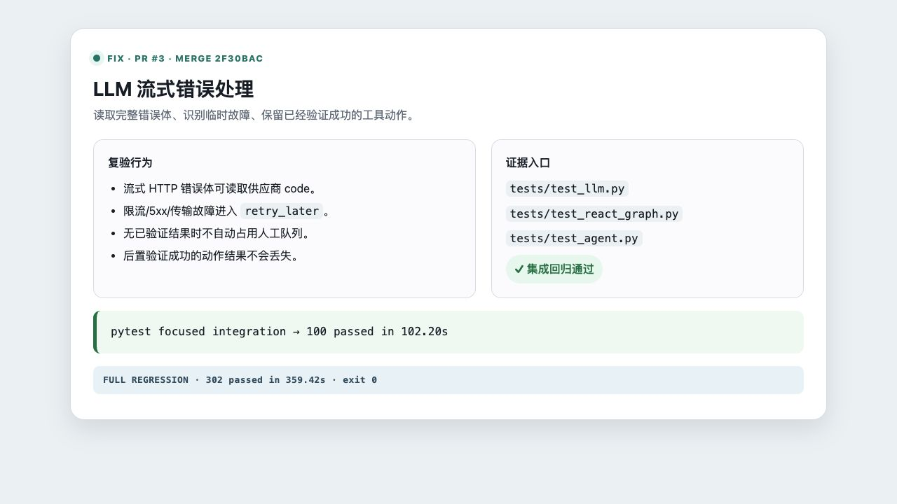

# LLM 流式错误处理修复

- 类型：fix
- 来源：PR #3，`fix/llm-stream-error-handling`
- 功能提交：`a4c9bee`、`017ae0a`
- fork `main` 合并提交：`2f30bac`

## 改动

流式响应返回 HTTP 错误时先完整读取响应体，再解析供应商错误码，避免在未消费 stream 时触发二次异常。模型限流、上游 5xx 或传输故障会进入可重试降级；已有后置条件验证成功的工具结果不会因随后模型故障而丢失，也不会无谓占用人工队列。

## 操作说明

无需新增运维开关。继续使用原有 `MODEL_*` 配置启动服务：

1. 模型临时不可用且没有已验证结果时，顾客收到“稍后重试/可主动转人工”的提示，系统不会自动建人工任务。
2. 工具结果已经通过后置验证时，系统保留成功结果并完成响应。
3. 业务拒绝或不可恢复的模型格式错误仍走原安全边界，不会被当成临时故障放行。

## 验证

```bash
.venv/bin/python -m pytest -q \
  tests/test_llm.py tests/test_react_graph.py tests/test_agent.py
```

合并后定向集成矩阵结果：`100 passed`。覆盖流式错误体读取、供应商限流码、`retry_later` 路由和已验证动作保留。

合并后完整测试套件：`302 passed in 359.42s`。


