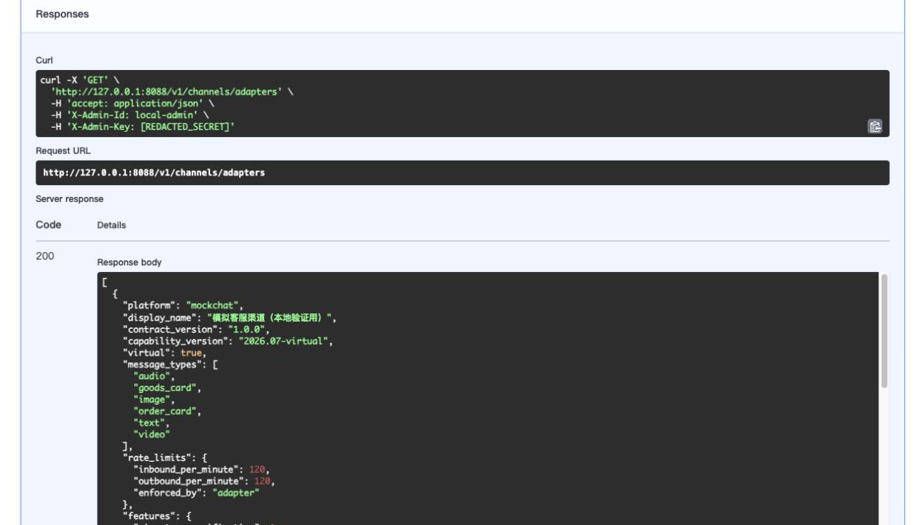

# F-101 通用渠道适配器 SDK

- 类型：feature
- 来源：PR #5，`feature/f101-channel-adapter-sdk`
- 功能提交：`c2bc7f7`
- fork `main` 合并提交：`20338bf`

## 改动

新增 `channel_sdk` 标准契约：能力声明、入站信封、验签/防重放、去重、发送命令、投递回执、错误分类、草稿和会话归属。淘宝适配器与协议不同的本地 `mockchat` 适配器共用契约；渠道 Agent 与 outbox 按 platform 隔离。

## 操作说明

本地验证第二渠道时显式启用虚拟适配器：

```bash
export MOCKCHAT_ENABLED=true
export MOCKCHAT_SECRET='替换为测试密钥'
export MOCKCHAT_AUTO_REPLY_ENABLED=true
export MOCKCHAT_MESSAGES_PER_MINUTE=120
yunpai-agent serve --host 127.0.0.1 --port 8080
```

管理员查询已注册能力：

```bash
curl -s http://127.0.0.1:8080/v1/channels/adapters \
  -H 'X-Admin-Id: local-admin' \
  -H 'X-Admin-Key: 替换为管理员密钥'
```

真实淘宝适配器保持非虚拟；`mockchat` 仅用于本地契约与运行时验证，不代表真实第二渠道联调完成。

## 验证

```bash
.venv/bin/python -m pytest -q \
  tests/test_channel_sdk_contract.py tests/test_channel_sdk_runtime.py
```

合并后定向集成矩阵结果：`100 passed`，包含双适配器契约、注册表路由、限流、幂等发送、错误回执与平台隔离。

合并后完整测试套件：`302 passed in 359.42s`。

截图为隔离服务上 Swagger 实际执行 `GET /v1/channels/adapters` 的界面：请求 URL、脱敏后的认证头、HTTP `200` 和真实响应体同时可见；响应列出 `mockchat` 与 `taobao` 的契约版本、消息类型和能力声明。


