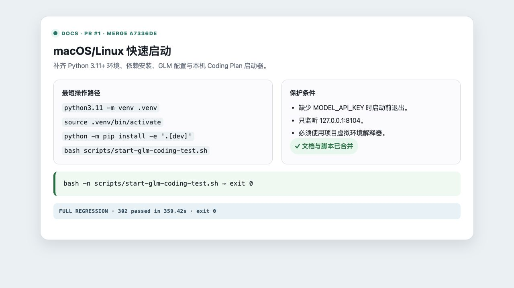

# macOS/Linux 快速启动与 Coding Plan 启动器

- 类型：docs
- 来源：PR #1，`docs/macos-quickstart`
- 功能提交：`9d1bd8b`、`032ab49`、`f20ab04`
- fork `main` 合并提交：`a7336de`

## 改动

README 增加 macOS/Linux 的 Python 3.11+ 虚拟环境、安装、环境变量和启动说明；新增 `scripts/start-glm-coding-test.sh`，并补充系统架构图及 `.idea/` 忽略规则。

## 操作说明

```bash
python3.11 -m venv .venv
source .venv/bin/activate
python -m pip install -e '.[dev]'
export MODEL_API_KEY='替换为 Coding Plan 密钥'
bash scripts/start-glm-coding-test.sh
```

服务只监听 `127.0.0.1:8104`。脚本要求项目 `.venv/bin/python` 存在；若 `MODEL_API_KEY` 未设置会在启动前明确退出。

## 验证

```bash
bash -n scripts/start-glm-coding-test.sh
git diff --check origin/main...main
```

合并后定向集成矩阵结果：`100 passed`；启动器另执行 shell 语法检查。

合并后完整测试套件：`302 passed in 359.42s`。


