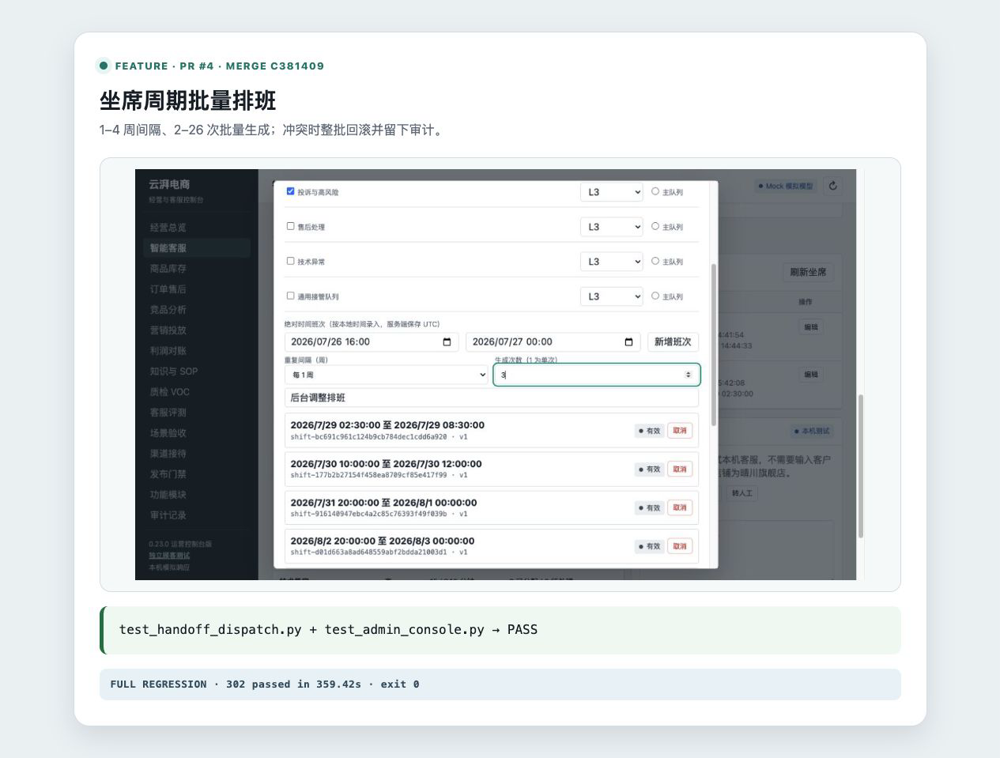

# 坐席周期批量排班

- 类型：feature
- 来源：PR #4，`feature/recurring-operator-shifts`
- 功能提交：`c864e75`
- fork `main` 合并提交：`c381409`

## 改动

在既有绝对时间班次上新增按周批量生成。一次请求可按 1–4 周间隔生成 2–26 个班次，全部在同一事务中创建；任何一个窗口与已有班次冲突时整批拒绝，不留下部分结果。后台可直接填写重复间隔和生成次数。

## 操作说明

后台进入“智能客服 → 坐席配置”，编辑坐席后填写起止时间、重复间隔和次数。也可调用：

```bash
curl -X POST \
  http://127.0.0.1:8080/v1/handoffs/operators/local-admin/shifts/recurring \
  -H 'Content-Type: application/json' \
  -H 'X-Admin-Id: local-admin' \
  -H 'X-Admin-Key: 替换为管理员密钥' \
  -d '{
    "starts_at":"2026-08-03T09:00:00+08:00",
    "ends_at":"2026-08-03T18:00:00+08:00",
    "repeat_every_weeks":1,
    "occurrences":4
  }'
```

时间必须带 UTC offset；单班至少 15 分钟、最长 24 小时。

## 验证

```bash
.venv/bin/python -m pytest -q \
  tests/test_handoff_dispatch.py tests/test_admin_console.py
```

合并后定向集成矩阵结果：`100 passed`，覆盖原子生成、周期间隔、参数校验、冲突回滚、列表与审计。

合并后完整测试套件：`302 passed in 359.42s`。

截图内嵌真实后台“坐席配置”界面，可见每 1 周、生成 3 次的输入，以及随后生成的多条班次记录。


