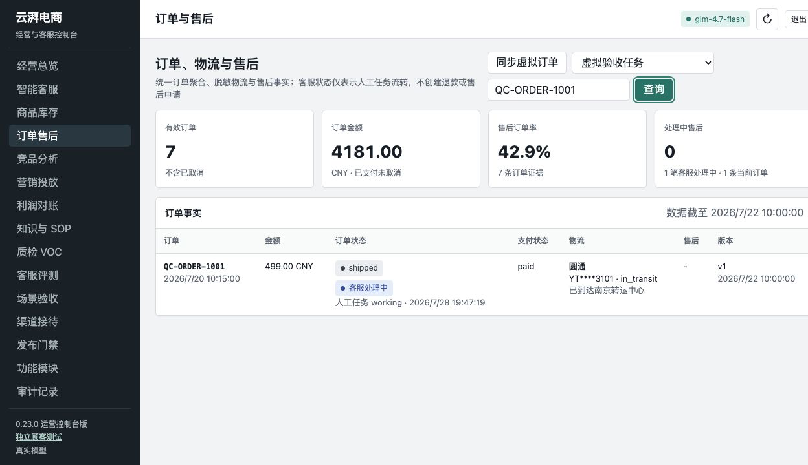

# 订单售后展示人工客服处理状态

- 类型：feature
- 来源：PR #6，`feature/order-handoff-visibility`
- 功能提交：`f7ec59f`
- fork `main` 合并提交：`26d9bed`

## 改动

人工任务会保存可信的订单与店铺业务上下文。订单列表按数据范围关联仍在处理中的人工任务，返回独立的 `customer_service` 状态；后台将“客服处理中”与退款/售后申请明确分开，不篡改订单、支付或售后事实。

## 操作说明

1. 顾客针对已绑定订单提出需要人工处理的诉求。
2. 坐席认领任务并进入处理状态。
3. 后台打开“订单售后”，切换到任务所属数据范围。
4. 订单卡片显示“客服处理中”；售后申请仍以订单事实中的 `after_sales` 为准。

API 查询示例：

```bash
curl -s \
  'http://127.0.0.1:8080/v1/orders?order_id=ORDER-1001&scope=simulation' \
  -H 'X-Admin-Id: local-admin' \
  -H 'X-Admin-Key: 替换为管理员密钥'
```

## 验证

```bash
.venv/bin/python -m pytest -q tests/test_order_handoff_visibility.py
```

合并后定向集成矩阵结果：`100 passed`。专项验证客服状态为 `processing` 时订单/支付状态不变，且不会创建售后记录。

合并后完整测试套件：`302 passed in 359.42s`。

截图为隔离服务的真实后台订单页：在“虚拟验收任务”范围查询 `QC-ORDER-1001` 后，订单显示“客服处理中 / 人工任务 working”，售后列仍为 `-`，订单状态保持 `shipped`。


