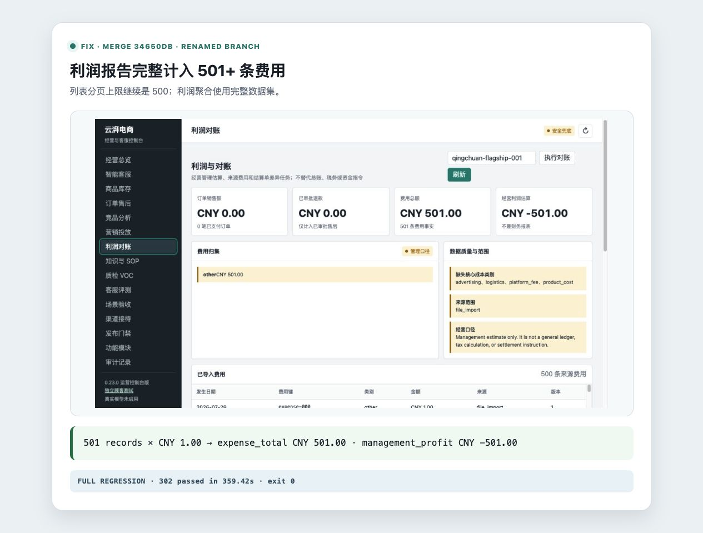

# 利润报告费用截断修复

- 类型：fix
- 原分支名：`codex/fix-finance-expense-truncation`
- 合并前重命名：`fix/finance-expense-truncation`
- 功能提交：`be9afe7`
- fork `main` 合并提交：`34650db`

## Bug 与修复

费用列表 API 为页面显示最多返回 500 条，但利润报告错误复用了这个分页上限，导致第 501 条及之后的费用未计入。修复后利润计算使用独立的完整费用聚合路径，页面列表仍保留 500 条上限。

## 操作说明

调用利润接口不需要新增参数：

```bash
curl -X POST http://127.0.0.1:8080/v1/finance/profit \
  -H 'Content-Type: application/json' \
  -H 'X-Admin-Id: local-admin' \
  -H 'X-Admin-Key: 替换为管理员密钥' \
  -d '{"store_id":"qingchuan-flagship-001"}'
```

核对返回值中的 `record_counts.expenses`、`expense_total` 与 `management_profit`。管理利润仍是经营估算，不是总账、税务或结算指令。

## 验证

```bash
.venv/bin/python -m pytest -q tests/test_marketing_finance_api.py
```

回归场景写入 501 条、每条 CNY 1.00 的费用：列表仍为 500 条，利润报告计数为 501、费用总额 CNY 501.00、管理利润 CNY -501.00。合并后定向集成矩阵结果：`100 passed`。

合并后完整测试套件：`302 passed in 359.42s`。


