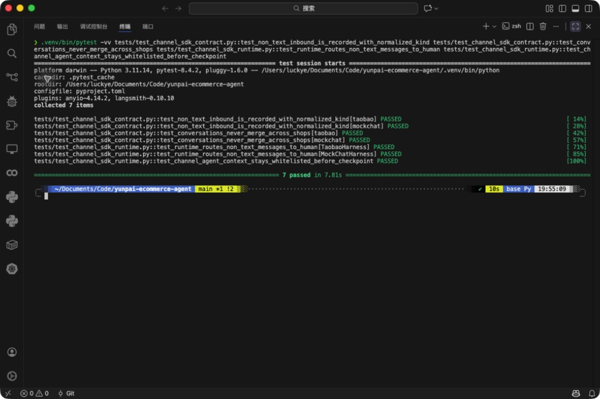

# F-103 统一渠道会话与可信上下文信封

- 类型：feature
- 来源：`feature/f103-channel-context-envelope`
- 功能提交：`98e65ff`
- fork `main` 合并提交：`9a226f5`

## 改动

标准入站信封新增 `message_kind`，统一 text、image、audio、video、goods_card、order_card、system 与 unknown。非文本消息会记录去重后的脱敏占位符，并强制转人工，不将媒体载荷送入模型；Agent 上下文只保留 platform 与 shop_id 白名单。会话键同时隔离租户、店铺与渠道。

## 操作说明

渠道适配器实现 `message_kind()` 并按标准 `InboundEnvelope` 返回数据。运行时规则：

1. `text` 可进入 Agent。
2. 非文本消息保留事件与任务证据，标记 `unsupported_message_kind` 后转人工。
3. 外部载荷中的订单号、授权标记等字段不会自动进入可信上下文。
4. 同一外部会话号在不同租户或店铺下必须产生独立会话。

## 验证

```bash
.venv/bin/python -m pytest -q \
  tests/test_channel_sdk_contract.py tests/test_channel_sdk_runtime.py
```

合并后定向集成矩阵结果：`100 passed`，覆盖双适配器非文本处置、敌意载荷白名单和跨租户/店铺隔离。

合并后完整测试套件：`302 passed in 359.42s`。

截图为合并后 `main` 的 VS Code 集成终端实际运行 4 个具名测试入口的结果；参数化后共收集 7 个用例，终端显示 `7 passed in 7.81s`，覆盖消息类型标准化、跨店铺隔离、非文本转人工和上下文白名单。


