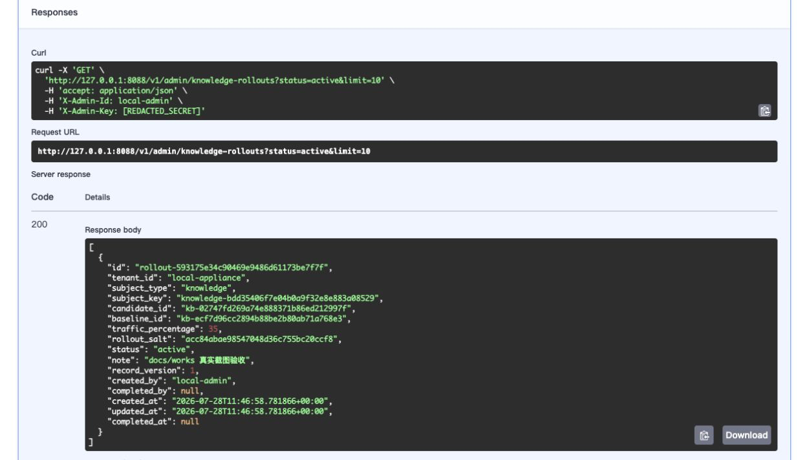

# F-104 知识灰度发布

- 类型：feature
- 来源：`feature/f104-knowledge-gray-release`
- 功能提交：`7ea16f2`
- fork `main` 合并提交：`4c41894`

## 改动

新增通用 `staged_rollouts` 灰度记录。已评测候选知识可按会话稳定分桶发布，在 baseline 与 candidate 之间确定性选择；支持开始、调量、完成和回滚。同一知识 key 只允许一个活动灰度，无分桶单元的评测/进化路径始终读取基线。

## 操作说明

候选知识完成评测后，调用：

```bash
curl -X POST \
  http://127.0.0.1:8080/v1/admin/knowledge/KNOWLEDGE_ID/rollouts \
  -H 'Content-Type: application/json' \
  -H 'X-Admin-Id: local-admin' \
  -H 'X-Admin-Key: 替换为管理员密钥' \
  -d '{"expected_record_version":2,"traffic_percentage":10,"note":"10% 灰度"}'
```

随后通过 `/v1/admin/knowledge-rollouts/{id}/traffic` 调量，确认后调用 `/complete`，异常时调用 `/rollback`。每次变更都必须提交当前 `expected_record_version`。

## 验证

```bash
.venv/bin/python -m pytest -q tests/test_knowledge_rollout.py
```

合并后定向集成矩阵结果：`100 passed`，覆盖 50% 稳定分桶、100% 放量、原子完成、一步回滚、租户隔离、API 鉴权与版本冲突。

合并后完整测试套件：`302 passed in 359.42s`。

截图为隔离服务上 Swagger 实际查询活动知识灰度的结果：请求 URL、HTTP `200` 与响应体同时可见，记录显示 `traffic_percentage: 35`、`status: active`，认证密钥已脱敏。


