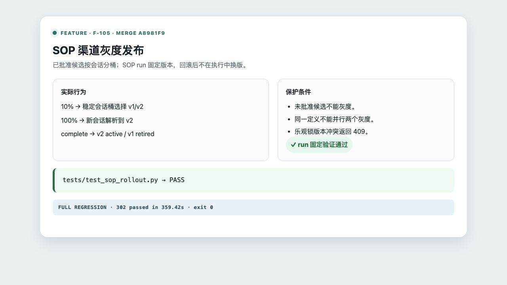

# F-105 SOP 灰度发布

- 类型：feature
- 来源：`feature/f105-sop-gray`
- 功能提交：`353e327`
- fork `main` 合并提交：`a8981f9`

## 改动

SOP 复用 `staged_rollouts` 实现按会话稳定分桶。候选版本必须已批准；新会话按流量选择版本，已创建的 SOP run 固定版本，即使随后回滚也不会在运行中换版。完成灰度时原子激活候选并退役基线。

## 操作说明

```bash
curl -X POST \
  http://127.0.0.1:8080/v1/admin/sop-versions/SOP_VERSION_ID/rollouts \
  -H 'Content-Type: application/json' \
  -H 'X-Admin-Id: local-admin' \
  -H 'X-Admin-Key: 替换为管理员密钥' \
  -d '{"expected_record_version":3,"traffic_percentage":10,"note":"SOP 10% 灰度"}'
```

通过 `/v1/admin/sop-rollouts/{id}/traffic` 调量；通过 `/complete` 或 `/rollback` 结束。不能对未批准版本发起灰度，同一定义也不能同时存在两个活动灰度。

## 验证

```bash
.venv/bin/python -m pytest -q tests/test_sop_rollout.py
```

合并后定向集成矩阵结果：`100 passed`，覆盖会话分桶、run 版本固定、回滚、全量放量、原子完成、租户隔离和 API 冲突。

合并后完整测试套件：`302 passed in 359.42s`。


