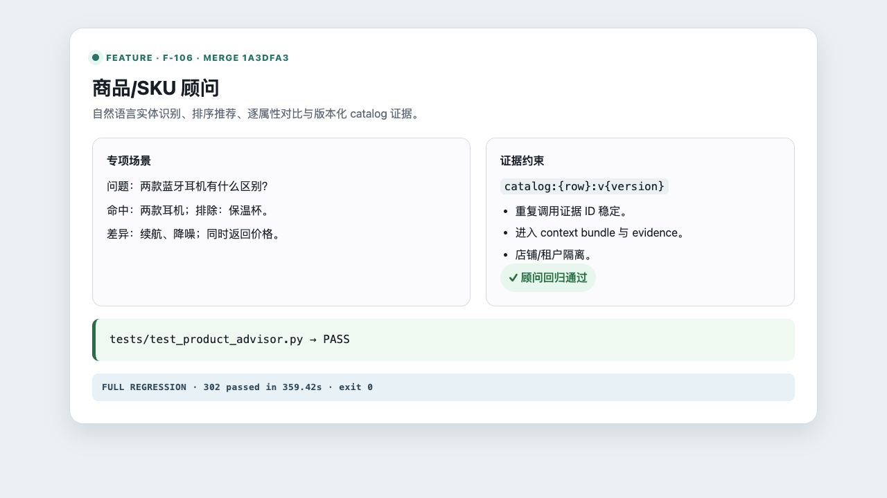

# F-106 商品/SKU 顾问

- 类型：feature
- 来源：`feature/f106-product-advisor`
- 功能提交：`cdbc43a`
- fork `main` 合并提交：`1a3dfa3`

## 改动

`product_advisor` 在当前租户与店铺的在售商品中识别标题、SKU 和属性词，返回排序候选与稳定证据 ID（`catalog:{row}:v{version}`）。对比意图命中至少两个候选时生成价格和逐属性差异，并将结果写入 ContextBuilder bundle 与 evidence。

## 操作说明

先通过 `/v1/catalog/items` 导入带来源版本的在售商品。顾客会话必须带可信 `shop_id`；随后可直接提出：

```text
这两款蓝牙耳机有什么区别？更看重续航和降噪。
```

无店铺上下文或无匹配时顾问返回空候选；跨租户或跨店铺商品不会进入结果。真实商品数据接入仍需要正式 connector，不应把虚拟目录当生产证据。

## 验证

```bash
.venv/bin/python -m pytest -q tests/test_product_advisor.py
```

合并后定向集成矩阵结果：`100 passed`，覆盖两款耳机识别、保温杯排除、稳定证据 ID、续航/降噪差异、bundle 嵌入和租户/店铺隔离。

合并后完整测试套件：`302 passed in 359.42s`。


