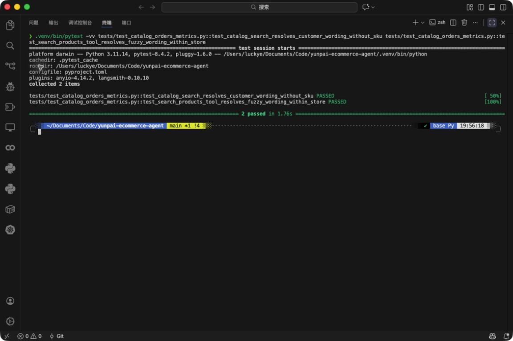

# F-106 商品自然语言模糊检索

- 类型：feature
- 来源：`feature/f106-fuzzy-product-lookup`
- 功能提交：`0fb9bdc`
- fork `main` 合并提交：`8a8f9b7`

## 改动

新增只读 L0 工具 `search_products`，按顾客说出的商品名、品类、型号、颜色、容量等自然语言检索当前店铺在售商品。Graph 与提示词会在顾客不知道 SKU 时先做检索，不再要求顾客提供内部 SKU 编号；精确 SKU 查询仍由 `get_product_facts` 承担。

## 操作说明

商品目录准备完成后，顾客可直接问：

```text
你们家的空气炸锅多少钱？黑色的还有吗？
```

模型应先调用 `search_products`，参数使用自然语言 `query` 与可信 `store_id`。结果包含候选 SKU、售价、状态、属性和来源版本；无可信店铺范围时策略门会拒绝查询。

## 验证

```bash
.venv/bin/python -m pytest -q \
  tests/test_catalog_orders_metrics.py \
  tests/test_policy.py \
  tests/test_react_graph.py
```

合并后定向集成矩阵结果：`100 passed`，覆盖“空气炸锅”等自然语言检索、店铺隔离、工具策略和不再向顾客索要 SKU 的图路由。

合并后完整测试套件：`302 passed in 359.42s`。

截图为合并后 `main` 的 VS Code 集成终端实际运行 2 个自然语言模糊检索具名回归用例，终端显示 `2 passed in 1.76s`。


