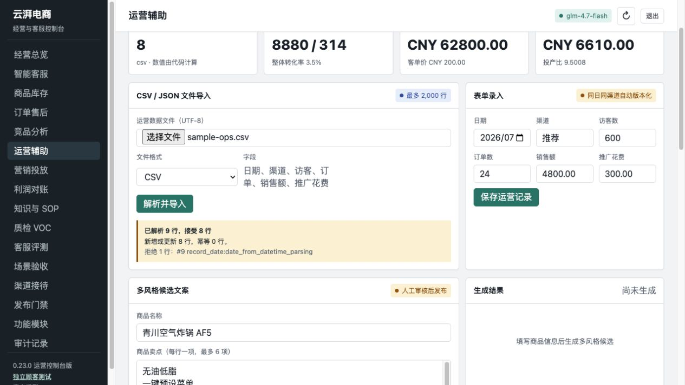
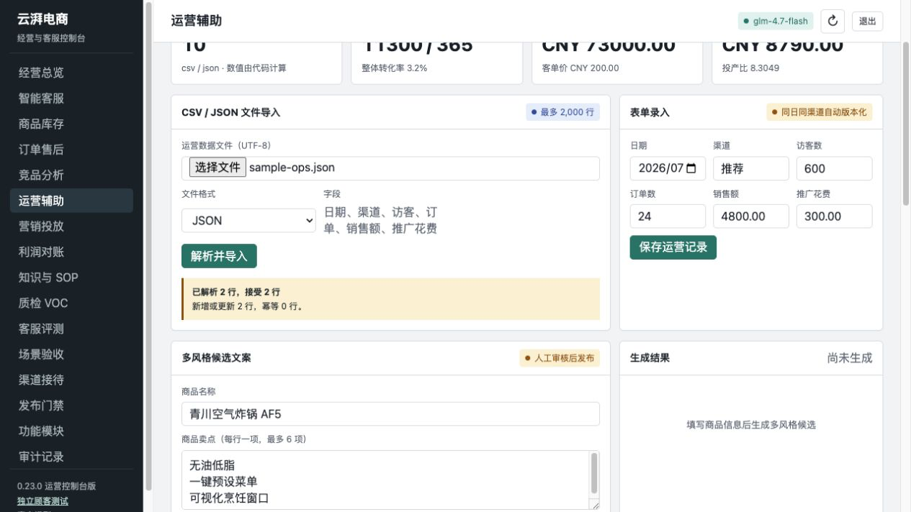
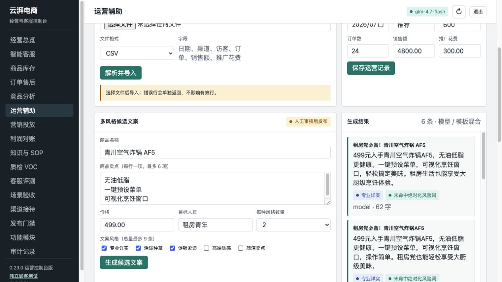
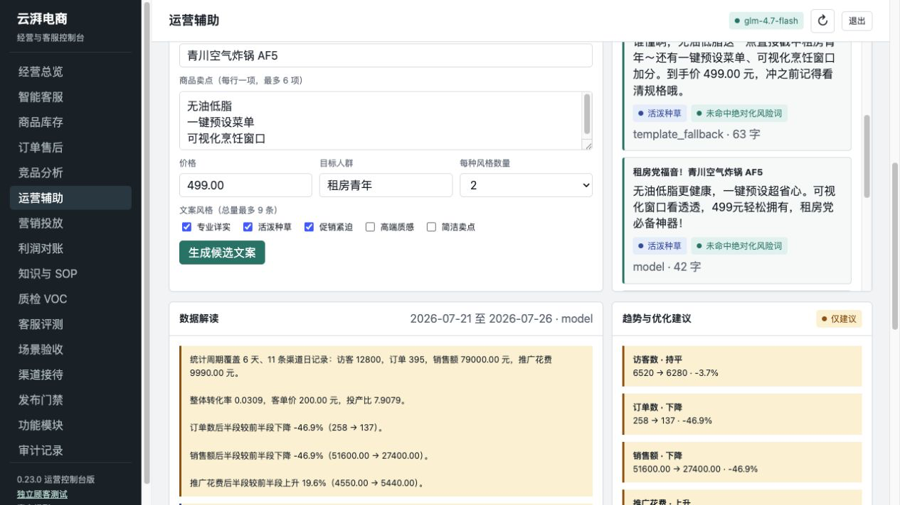
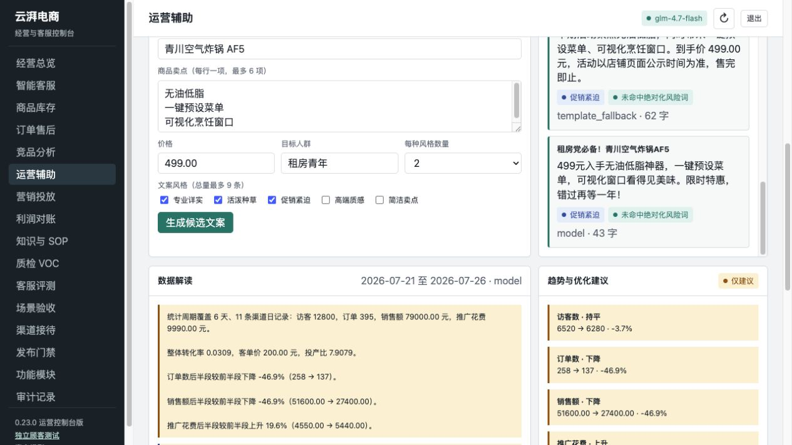
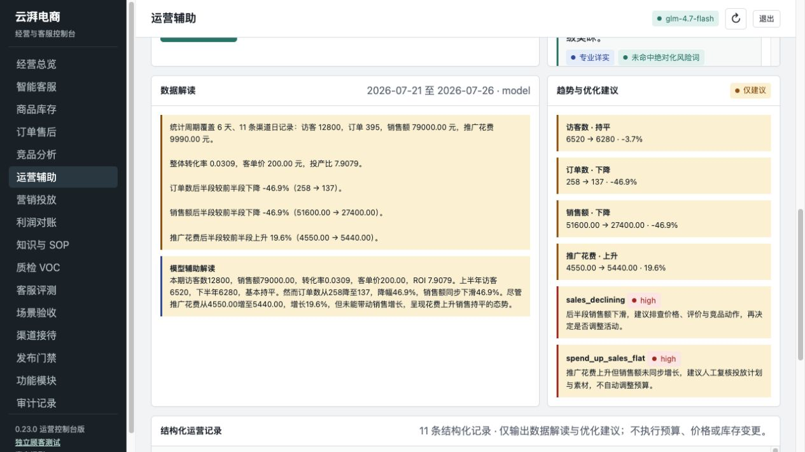
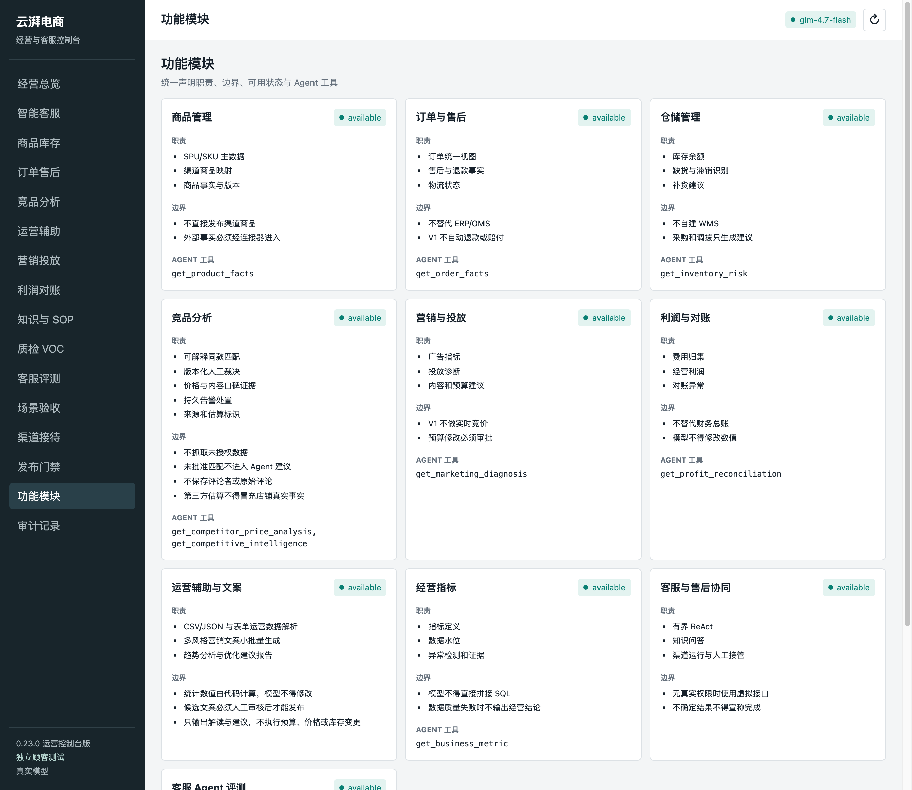
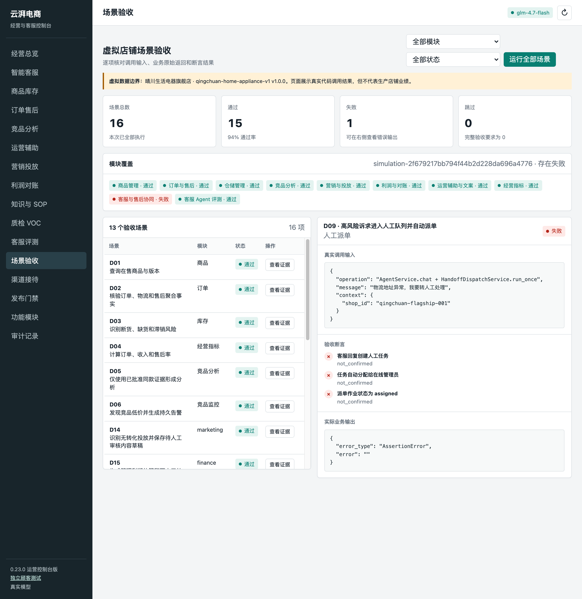
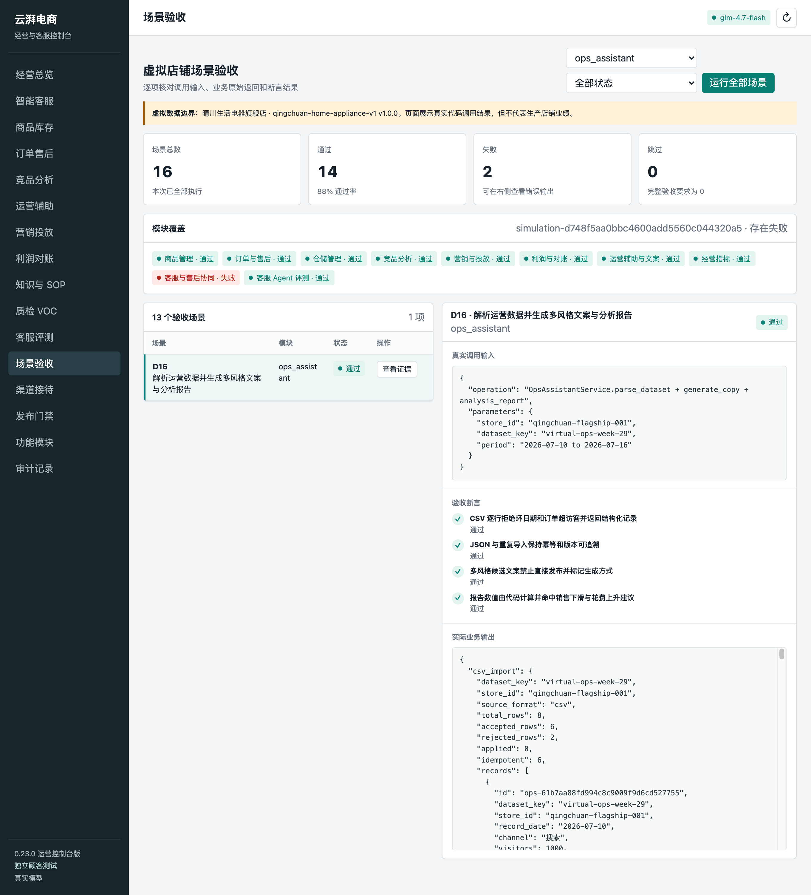

# M5 运营辅助与文案生成

- 类型：feature
- 分支：`feature/m5-operations-assistant`
- 基线：`f205f16`
- 状态：开发与验收完成，按要求未提交

## 交付范围

本次交付包含运营数据解析服务、营销文案生成后端服务、运营分析报告生成服务，以及可直接操作这些能力的管理台页面。

| 验收项 | 页面入口 | 后端接口 | 实现结果 |
|---|---|---|---|
| CSV / JSON 上传解析 | 运营辅助 → 文件导入 | `POST /v1/ops-assistant/datasets/import` | 支持中英文表头、UTF-8 BOM、逐行拒绝原因、2,000 行单次上限 |
| 表单录入 | 运营辅助 → 表单录入 | `POST /v1/ops-assistant/records` | 按租户、数据集、日期和渠道幂等写入并版本化 |
| 结构化数据返回 | 运营辅助 → 结构化运营记录 | `GET /v1/ops-assistant/records` | 返回销售、投放、转化率、来源格式和版本 |
| 多风格小批量文案 | 运营辅助 → 多风格候选文案 | `POST /v1/ops-assistant/copywriting/generate` | 5 种风格、每种 1–3 条、单批最多 9 条 |
| 趋势分析与优化建议 | 运营辅助 → 数据解读 | `POST /v1/ops-assistant/reports/analysis` | 代码计算总量/趋势/渠道表现，模型只负责文字解读 |
| 模块登记与场景覆盖 | 功能模块 / 场景验收 | `GET /v1/simulations/virtual-store` | 登记为 `available` 业务模块，并由 D16 虚拟店铺场景实测覆盖 |

## 关键实现

- `src/ecommerce_agent/business/ops_assistant.py`
  - `OpsOperationRecordUpsert`：约束日期、渠道、访客、订单、销售额和推广花费，拒绝订单数大于访客数。
  - `CopywritingRequest`：支持 `formal`、`playful`、`urgent`、`premium`、`concise`，强制小批量上限。
  - `OpsAssistantService`：完成 CSV / JSON 解析、表单写入、模型文案、确定性模板降级、风险词标记和分析报告。
  - 报告读取不复用列表接口的 500 条展示上限，避免大数据集被静默截断。
- `src/ecommerce_agent/ops_assistant_api.py`
  - 接入管理员鉴权、UTF-8 BOM 解码、导入/写入/文案/报告审计。
- `src/ecommerce_agent/database.py`
  - schema 升级为 v25，新增 `ops_operation_records` 及租户/店铺/日期索引。
- `docs/admin-console.html`
  - 新增“运营辅助”导航与文件上传、表单、文案、报告和结构化记录界面。
  - 文件直接在浏览器读取并上传；JSON 扩展名会自动切换格式。
  - 每条文案显示 `model`、`template` 或 `template_fallback`，混合结果不会被误标为纯模型生成。
- `src/ecommerce_agent/business/registry.py`
  - 登记 `ops_assistant` 业务模块，状态 `available`，后台“功能模块”页与自检的 `business_modules` 从此包含运营辅助。
- `src/ecommerce_agent/fixtures/virtual_store_v1.json` 与 `src/ecommerce_agent/simulation.py`
  - 新增 D16 虚拟店铺场景与 `_verify_ops_assistant`，把 `simulation-evidence-v1` 契约从 15 项扩展到 16 项。
  - 场景数据固定为 6 天单渠道运营数据加 2 行坏数据，报告合计和建议码可确定性断言。
- `tests/test_ops_assistant.py`
  - 覆盖 CSV、JSON、BOM、表单、幂等/版本、租户隔离、模型成功/失败、风险词、小批量限制、完整报告、500 条以上报告和 API 鉴权/审计。
- `tests/test_virtual_store_simulation.py`
  - 场景总数与 available 模块覆盖数同步为 16 项与 10 个，并断言 D16 的拒绝行数、幂等重放、禁止发布和报告合计。

## 安全与执行边界

- 所有销售、投放、转化率、客单价和 ROI 数值均由代码计算，模型不能修改统计值。
- 模型不可用或单次调用失败时逐条降级为确定性模板；返回值显式标记生成方式。
- 所有候选文案 `publication_allowed=false`，发布前必须人工审核卖点、价格和促销主张。
- 报告仅给出数据解读与建议，不执行预算、价格、库存或发布操作。
- `env.md` 已加入 `.gitignore`；本文和截图不记录管理员密钥或模型密钥。
- D16 虚拟店铺场景使用独立的 `virtual-ops-week-29` 与 `virtual-ops-live-week-29` 数据集键，虚拟验收数据不与真实运营数据集混算。

## 测试证据

### 反证与回归门禁

1. 将同一份 M5 测试放到父版本快照运行，测试收集阶段因缺少 `CopywritingRequest` / M5 服务而失败，证明父版本不具备该能力。
2. 新增 BOM、报告审计和管理台契约断言后，修改实现前得到 3 个预期失败：
   - BOM CSV 接受行数为 0；
   - `ops.report.generated` 审计为空；
   - 管理台没有运营辅助页面。
3. 新增 501 条报告反例后，修改实现前得到 `record_count 500 != 501`，证明原报告会复用列表分页上限。
4. 第一次全量测试为 `310 passed, 3 failed in 276.89s`。失败原因是把 M5 登记为虚拟店铺 available 模块，却没有扩展既有 15 场景 `simulation-evidence-v1` 契约。该缺口已正式修复：新增 D16 场景与 `_verify_ops_assistant`，契约扩展为 16 项，`ops_assistant` 以 `available` 状态登记并具备实测覆盖，不再靠“移除登记”规避门禁。
5. D16 门禁反证一：临时删除 `_module_coverage` 中的 `"ops_assistant": ["D16"]` 映射后，`report["passed"]` 由 `True` 变为 `False`，证明“登记为 available 就必须具备场景覆盖”的门禁真实生效，而非摆设。
6. D16 门禁反证二：临时把 fixture CSV 中的 `bad-date` 行改为合法日期 `2026-07-09` 后，`tests/test_virtual_store_simulation.py` 两个用例均失败，证明 D16 确实在校验逐行拒绝行为而不是空跑。两处反证均已还原，还原后定向复验为 `20 passed in 15.47s`。

### 最终结果

```bash
NO_PROXY=127.0.0.1,localhost \
no_proxy=127.0.0.1,localhost \
ALL_PROXY=http://127.0.0.1:9 \
HTTP_PROXY=http://127.0.0.1:9 \
HTTPS_PROXY=http://127.0.0.1:9 \
.venv/bin/python -m pytest -q
```

结果：`313 passed in 258.49s`，退出码 `0`。

补齐模块登记与 D16 场景后再次全量复验为 `313 passed in 409.99s`；两处门禁反证还原、文档与截图补全后做最终确认，结果为 `313 passed in 216.74s`，退出码均为 `0`。用例总数保持 313 不变，因为 D16 是虚拟店铺场景而非新增 pytest 用例，其断言并入既有虚拟店铺用例。

最终管理台、M5 与场景契约定向复验：

```bash
.venv/bin/python -m pytest -q \
  tests/test_ops_assistant.py \
  tests/test_admin_console.py \
  tests/test_virtual_store_simulation.py \
  tests/test_operations_modules.py
```

结果：`20 passed in 15.47s`，退出码 `0`。

附加检查：`git diff --check` 无输出；`python -m compileall -q src` 通过。

## 浏览器实跑

使用 `env.md` 中的模型与认证配置、隔离 `DATA_DIR`，执行：

```bash
yunpai-agent init
yunpai-agent serve --host 127.0.0.1 --port 8080
```

初始化返回 `mode=live_model`、`glm-4.7-flash`、数据库 schema v25。随后在真实 `/admin` 页面完成：

1. 上传 `sample-ops.csv`：解析 9 行，接受 8 行，拒绝坏日期 1 行。
2. 上传 `sample-ops.json`：接受 2 行。
3. 表单录入 1 行：日期 `2026-07-26`、渠道 `推荐`、访客 1500、订单 30、销售额 `6000.00`、推广花费 `1200.00`。页面最终显示 11 条记录，来源为 `csv / form / json`。该行数值与两个样本文件相加即为下方报告合计，便于原样复现。
4. 选择专业详实、活泼种草、促销紧迫三种风格，每种 2 条，生成 6 条候选；供应商个别调用失败时同批结果按条降级并显示“模型 / 模板混合”。
5. 报告显示访客 12,800、订单 395、销售额 79,000.00、推广花费 9,990.00、ROI 7.9079；真实模型叙述指出订单/销售下降和投放上升，代码规则给出 `sales_declining` 与 `spend_up_sales_flat` 建议。
6. 页面运行期间浏览器 console warning/error 为 0。

### CSV 与 JSON 导入





### 多风格文案







### 分析报告



`verification.png` 与最终分析报告截图相同，供 `docs/works` 既有验证图约定使用。

### 模块登记与场景验收

补齐模块登记后，在同一套 `env.md` 配置、隔离 `DATA_DIR` 的真实服务上复验后台页面。

后台“功能模块”页现在包含“运营辅助与文案 · available”，职责与边界由 `registry.py` 统一声明，前端 `moduleGrid` 从 `/v1/operations/modules` 动态渲染，无需改前端代码：



“场景验收”页场景总数为 16，模块筛选器新增 `ops_assistant`，模块覆盖显示“运营辅助与文案 · 通过”：



筛选 `ops_assistant` 后展开 D16 证据，四条验收断言全部通过，实际业务输出可见 `total_rows 8 / accepted_rows 6 / rejected_rows 2`，重复运行时 `applied 0 / idempotent 6`：



需要如实说明：上面两张场景验收截图中，`客服与售后协同` 显示失败，失败项为既有场景 D09（高风险诉求进入人工队列并自动派单），断言为 `客服回复创建人工任务` 等三条 `not_confirmed`。该场景依赖真实模型是否判定转人工，在 `MODEL_ENABLED=true` 的 live 模型下不稳定，两次连续实跑分别为 `15 passed / 1 failed` 与 `14 passed / 2 failed`，失败项均集中在客服类场景。这是接入 live 模型后的既有行为，与 M5 无关：D16 与 `ops_assistant` 覆盖在两次实跑中均为“通过”，且模型受控的完整 pytest 套件中虚拟店铺用例断言 `summary` 为 `16 passed / 0 failed / 0 skipped`、`report["passed"] is True`。

## 操作说明

请求必须使用管理员认证。不要把真实密钥写入命令历史或文档；从本机忽略的 `env.md` 加载。

```bash
curl -sS \
  -H "X-Admin-Id: $BOOTSTRAP_ADMIN_ID" \
  -H "X-Admin-Key: $ADMIN_API_KEY" \
  -H "Content-Type: text/csv; charset=utf-8" \
  --data-binary @sample-ops.csv \
  "http://127.0.0.1:8080/v1/ops-assistant/datasets/import?dataset_key=ops-week-30&store_id=qingchuan-flagship-001&source_format=csv"
```

文案与报告均可在管理台直接操作，无需手工构造 JSON。开发数据库和截图样本仅用于本地验收，不构成生产经营结论。
